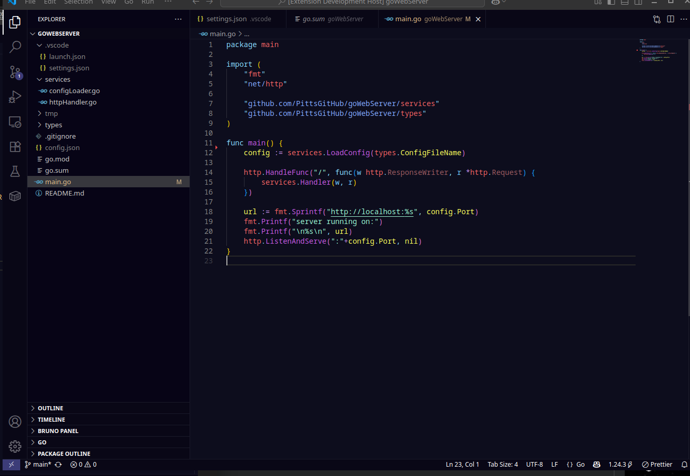

# Go-Dark 🥷

a Golang focused high-contrast dark theme



### ❗❗❗IMPORTANT❗❗❗

To get the full Go-Dark experience with expected colouring please follow these steps.

1. in your project root create a folder called .vscode

2. inside the .vscode folder create a filet called settings.json

3. add the following snippet to settings.json

4. OPTIONAL: add .vscode/settings.json to your .gitignore if these settings are personal and shouldn't be version controlled.

```
{
  "editor.semanticHighlighting.enabled": true,
  "gopls": {
    "ui.semanticTokens": true
  },
  "editor.semanticTokenColorCustomizations": {
    "enabled": true
  }
}
```

---

## Features

- 🟦 Semantic token support for Go
- 🎨 Custom pastel-based colors for strings, comments, and functions
- 🌘 Muted backgrounds with minimalist contrast
- 🧭 Unified UI with no jarring transitions between panels

## Credits

Designed by Dan Pittard

---

## License

MIT
